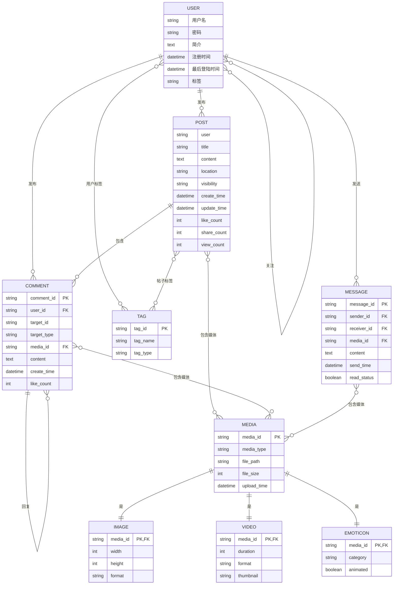

# 社交媒体网络 ER 模型

我们对一个一个简化版的、类似于小红书的社交媒体建立 ER 模型

## 实体

1. 用户
   - 用户名
   - 密码
   - 个人简介
   - 注册时间
   - 最后登陆时间
2. 帖子
   - 发布者
   - 标题
   - 正文
   - 多媒体素材：图片或是视频
   - 位置
   - 可见范围
   - 创建时间
   - 最后更新时间
   - 点赞数
   - 分享数
   - 标签：推荐算法/发布者为帖子打上的标签
   - 流量
3. 帖子 -> 评论
   - 发布者
   - 被评论实体：评论是不能凭空存在的，存在一个实体（帖子或者评论）被它评论
   - 多媒体素材
   - 正文
   - 创建时间
   - 点赞数
4. 多媒体素材
5. 多媒体素材 -> 图片
6. 多媒体素材 -> 视频
7. 多媒体素材 -> 表情包
8. 标签
9. 消息
   - 正文
   - 发送者
   - 接收者
   - 多媒体素材
   - 发送时间  

## 关系

- 一对多关系
  - 用户发布帖子
  - 帖子包含评论
  - 评论包含评论
  - 帖子/评论包含多媒体素材
  - 用户发送消息
- 多对一关系
- 多对多关系
  - 用户关注用户
  - 用户被打上标签
  - 帖子被打上标签
  - 帖子/评论/消息拥有多媒体素材

## ER 图

