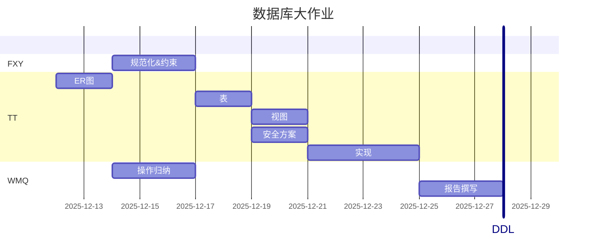

# 数据库期末项目

## 表的设计

### 1. 用户信息表 (user_info)

| 字段名 | 说明 |
| -------- | ------ |
| user_id | 用户ID（主键） |
| username | 用户名 |
| password | 密码 |
| register_time | 注册时间 |
| last_login_time | 最后登录时间 |
| bio | 个人简介 |
| location | 位置 |
| activity_score | 活跃度 |

### 2. 论坛表 (forum)

| 字段名 | 说明 |
| -------- | ------ |
| forum_id | 论坛ID（主键） |
| name | 名称 |
| description | 简介 |
| admin_id | 管理员ID（外键 → user_info） |
| post_count | 发帖数 |
| comment_count | 评论数 |
| view_count | 阅读量 |
| activity_score | 活跃度 |

### 3. 帖子表 (post)

| 字段名 | 说明 |
| -------- | ------ |
| post_id | 帖子ID（主键） |
| user_id | 用户ID（外键 → user_info） |
| forum_id | 论坛ID（外键 → forum） |
| title | 标题 |
| content | 正文 |
| create_time | 创建时间 |
| update_time | 更新时间 |
| visibility | 可见范围 |
| location | 位置 |
| like_count | 点赞数 |
| share_count | 转发数 |
| view_count | 阅读量 |
| interaction_score | 社区互动分数 |
| traffic_pool | 流量池 |

### 4. 评论表 (comment)

| 字段名 | 说明 |
| -------- | ------ |
| comment_id | 评论ID（主键） |
| user_id | 用户ID（外键 → user_info） |
| post_id | 所属帖子ID（外键 → post） |
| parent_comment_id | 父评论ID（外键 → comment） |
| content | 正文 |
| send_time | 发送时间 |
| like_count | 点赞数 |
| location | 位置 |
| nest_depth | 嵌套深度 |

### 5. 标签表 (tag)

| 字段名 | 说明 |
| -------- | ------ |
| tag_id | 标签ID（主键） |
| content | 内容 |

### 6. 直播表 (live)

| 字段名 | 说明 |
| -------- | ------ |
| live_id | 直播ID（主键） |
| streamer_id | 主播ID（外键 → user_info） |
| title | 标题 |
| description | 简介 |
| start_time | 开播时间 |
| play_count | 播放量 |
| like_count | 点赞数 |
| share_count | 转发 |
| status | 状态 |
| popularity_score | 热度 |

### 7. 消息表 (message)

| 字段名 | 说明 |
| -------- | ------ |
| message_id | 消息ID（主键） |
| sender_id | 发送者ID（外键 → user_info） |
| receiver_id | 接收者ID（外键 → user_info） |
| content | 内容 |
| send_time | 发送时间 |
| format | 格式 |
| message_type | 消息类型 |
| read_status | 已读状态 |

### 8. 多媒体素材表 (multimedia_material)

| 字段名 | 说明 |
| -------- | ------ |
| material_id | 素材ID（主键） |
| file_path | 文件位置 |
| file_size | 文件大小 |
| material_type | 素材类型 |
| upload_time | 上传时间 |
| content | 内容 |

### 9. 视频表 (video) - 继承多媒体素材

| 字段名 | 说明 |
| -------- | ------ |
| video_id | 视频ID（主键） |
| material_id | 素材ID（外键 → multimedia_material） |
| duration | 时长 |
| resolution | 清晰度 |
| format | 格式 |

### 10. 广告表 (ad) - 继承多媒体素材

| 字段名 | 说明 |
| -------- | ------ |
| ad_id | 广告ID（主键） |
| material_id | 素材ID（外键 → multimedia_material） |

### 11. 图片表 (image) - 继承多媒体素材

| 字段名 | 说明 |
| -------- | ------ |
| image_id | 图片ID（主键） |
| material_id | 素材ID（外键 → multimedia_material） |
| width | 宽 |
| height | 高 |
| depth | 深度 |

### 12. 表情包表 (emoji) - 继承多媒体素材

| 字段名 | 说明 |
| -------- | ------ |
| emoji_id | 表情包ID（主键） |
| material_id | 素材ID（外键 → multimedia_material） |

### 13. 直播记录表 (live_record)

| 字段名 | 说明 |
| -------- | ------ |
| user_id | 用户ID（主键，外键 → user_info） |
| live_id | 直播ID（主键，外键 → live） |
| relation_type | 关系类型（1=发起/2=观看） |
| like_status | 点赞 |
| share_status | 转发 |
| watch_duration | 观看时长 |

### 14. 用户—论坛记录表 (user_forum_record)

| 字段名 | 说明 |
| -------- | ------ |
| user_id | 用户ID（主键，外键 → user_info） |
| forum_id | 论坛ID（主键，外键 → forum） |
| relation_type | 关系类型（1=管理/2=加入） |
| join_time | 加入时间 |

### 15. 帖子标签记录表 (post_tag_record)

| 字段名 | 说明 |
| -------- | ------ |
| post_id | 帖子ID（主键，外键 → post） |
| tag_id | 标签ID（主键，外键 → tag） |
| tag_time | 标记时间 |

### 16. 用户标签记录表 (user_tag_record)

| 字段名 | 说明 |
| -------- | ------ |
| user_id | 用户ID（主键，外键 → user_info） |
| tag_id | 标签ID（主键，外键 → tag） |
| tag_time | 标记时间 |

### 17. 多媒体素材使用记录表 (multimedia_usage_record)

| 字段名 | 说明 |
| -------- | ------ |
| usage_id | 使用ID（主键） |
| material_id | 素材ID（外键 → multimedia_material） |
| user_id | 用户ID（外键 → user_info） |
| usage_scenario | 使用场景 |
| usage_time | 使用时间 |
| host_type | 宿主类型 |
| host_id | 宿主ID |

### 18. 直播标签记录表 (live_tag_record)

| 字段名 | 说明 |
| ------ | ------ |
| live_id | 直播ID（主键，外键 → live） |
| tag_id | 标签ID（主键，外键 → tag） |
| tag_time | 标记时间 |

## 表的约束

### 1. 主键约束 (Primary Key)

所有表均设置了主键：

- **单一主键**：user_info、forum、post、comment、tag、live、message、multimedia_material、video、ad、image、emoji、multimedia_usage_record
- **复合主键**：live_record (user_id, live_id)、user_forum_record (user_id, forum_id)、post_tag_record (post_id, tag_id)、user_tag_record (user_id, tag_id)、live_tag_record (live_id, tag_id)

### 2. 外键约束 (Foreign Key)

#### 用户关联

- forum.admin_id → user_info.user_id (ON DELETE RESTRICT)
- post.user_id → user_info.user_id (ON DELETE CASCADE)
- comment.user_id → user_info.user_id (ON DELETE CASCADE)
- live.streamer_id → user_info.user_id (ON DELETE CASCADE)
- message.sender_id → user_info.user_id (ON DELETE CASCADE)
- message.receiver_id → user_info.user_id (ON DELETE CASCADE)
- multimedia_usage_record.user_id → user_info.user_id (ON DELETE CASCADE)
- live_record.user_id → user_info.user_id (ON DELETE CASCADE)
- user_forum_record.user_id → user_info.user_id (ON DELETE CASCADE)
- user_tag_record.user_id → user_info.user_id (ON DELETE CASCADE)

#### 论坛关联

- post.forum_id → forum.forum_id (ON DELETE CASCADE)
- user_forum_record.forum_id → forum.forum_id (ON DELETE CASCADE)

#### 帖子关联

- comment.post_id → post.post_id (ON DELETE CASCADE)
- post_tag_record.post_id → post.post_id (ON DELETE CASCADE)

#### 评论关联

- comment.parent_comment_id → comment.comment_id (ON DELETE CASCADE)

#### 标签关联

- post_tag_record.tag_id → tag.tag_id (ON DELETE CASCADE)
- user_tag_record.tag_id → tag.tag_id (ON DELETE CASCADE)
- live_tag_record.tag_id → tag.tag_id (ON DELETE CASCADE)

#### 直播关联

- live_record.live_id → live.live_id (ON DELETE CASCADE)
- live_tag_record.live_id → live.live_id (ON DELETE CASCADE)

#### 多媒体素材关联

- video.material_id → multimedia_material.material_id (ON DELETE CASCADE)
- ad.material_id → multimedia_material.material_id (ON DELETE CASCADE)
- image.material_id → multimedia_material.material_id (ON DELETE CASCADE)
- emoji.material_id → multimedia_material.material_id (ON DELETE CASCADE)
- multimedia_usage_record.material_id → multimedia_material.material_id (ON DELETE CASCADE)

### 3. 唯一性约束 (Unique)

- user_info.username：用户名唯一
- tag.content：标签内容唯一
- video.material_id：视频与素材一对一
- ad.material_id：广告与素材一对一
- image.material_id：图片与素材一对一
- emoji.material_id：表情包与素材一对一

### 4. 检查约束 (Check)

#### 非负值约束

- user_info.activity_score >= 0
- forum.post_count >= 0
- forum.comment_count >= 0
- forum.view_count >= 0
- forum.activity_score >= 0
- post.like_count >= 0
- post.share_count >= 0
- post.view_count >= 0
- comment.like_count >= 0
- comment.nest_depth >= 0
- live.play_count >= 0
- live.like_count >= 0
- live.share_count >= 0
- live.popularity_score >= 0
- live_record.watch_duration >= 0

#### 正值约束

- multimedia_material.file_size > 0
- video.duration > 0
- image.width > 0
- image.height > 0

#### 枚举值约束

- post.visibility IN ('public', 'private', 'friends')
- live.status IN ('live', 'ended', 'scheduled')
- message.message_type IN ('private', 'system', 'notification')
- multimedia_material.material_type IN ('video', 'image', 'ad', 'emoji')
- multimedia_usage_record.host_type IN ('post', 'comment', 'message', 'live', 'user_avatar')
- live_record.relation_type IN (1, 2)
- user_forum_record.relation_type IN (1, 2)

### 5. 非空约束 (Not Null)

#### 用户信息表

- username、password、register_time 必填

#### 论坛表

- name、admin_id 必填

#### 帖子表

- user_id、forum_id、title、content、create_time 必填

#### 评论表

- user_id、post_id、content、send_time 必填

#### 标签表

- content 必填

#### 直播表

- streamer_id、title、start_time 必填

#### 消息表

- sender_id、receiver_id、content、send_time 必填

#### 多媒体素材表

- file_path、file_size、material_type、upload_time 必填

#### 关系表

- 所有关系表的主键字段均为必填

### 6. 默认值约束 (Default)

#### 时间戳默认值

- register_time: CURRENT_TIMESTAMP
- create_time: CURRENT_TIMESTAMP
- send_time: CURRENT_TIMESTAMP
- upload_time: CURRENT_TIMESTAMP
- start_time: CURRENT_TIMESTAMP
- join_time: CURRENT_TIMESTAMP
- tag_time: CURRENT_TIMESTAMP
- usage_time: CURRENT_TIMESTAMP

#### 计数器默认值

- activity_score: 0
- post_count: 0
- comment_count: 0
- view_count: 0
- like_count: 0
- share_count: 0
- play_count: 0
- popularity_score: 0
- nest_depth: 0
- watch_duration: 0

#### 状态默认值

- visibility: 'public'
- status: 'live'
- format: 'text'
- message_type: 'private'
- read_status: FALSE
- like_status: FALSE
- share_status: FALSE

### 7. 级联删除策略

- **CASCADE（级联删除）**：删除父记录时，自动删除所有子记录
  - 适用于大部分从属关系（帖子、评论、直播记录等）
  
- **RESTRICT（限制删除）**：如果存在子记录，禁止删除父记录
  - 仅用于 forum.admin_id，防止误删管理员账号

## 常用视图

### 1. 用户活跃度概览视图 (v_user_activity_summary)

- **说明**：整合用户基本信息及其发帖、评论、直播的累计数据，用于快速评估用户活跃等级。
- **包含字段**：用户ID、用户名、注册时间、发帖总数、评论总数、直播总数、活跃度评分。

### 2. 论坛综合统计视图 (v_forum_statistics)

- **说明**：汇总论坛的发帖量、评论量及平均互动得分，用于论坛运营分析。
- **包含字段**：论坛ID、论坛名称、管理员用户名、总发帖数、总评论数、总阅读量、综合活跃度。

### 3. 热门帖子详情视图 (v_hot_posts_detail)

- **说明**：关联帖子、作者及论坛信息，并包含点赞、转发等互动指标，方便前端展示。
- **包含字段**：帖子ID、标题、作者名、所属论坛名、点赞数、转发数、阅读量、互动分数、流量池等级。

### 4. 直播热度排行视图 (v_live_popularity_ranking)

- **说明**：计算直播间的实时热度（基于播放、点赞、转发）并关联主播信息。
- **包含字段**：直播ID、标题、主播名、开播时间、播放量、点赞数、热度分数、当前状态。

### 5. 标签使用频率视图 (v_tag_usage_stats)

- **说明**：统计各标签在帖子、用户和直播中的引用频次，用于发现热门话题。
- **包含字段**：标签ID、标签内容、帖子引用数、用户关注数、直播引用数、总引用频次。

### 6. 多媒体素材分类视图 (v_multimedia_assets)

- **说明**：整合素材基本信息与其具体的子类属性（如视频时长、图片分辨率），统一素材管理。
- **包含字段**：素材ID、文件路径、素材类型、上传时间、具体属性（时长/分辨率/尺寸等）。

## 常见操作

### 用户关系类

1. 查询用户A的基本账号信息，包括注册时间、最后登录时间、个人简介、位置、活跃度
2. 查询用户 A 在 2025 年 11 月 17 日发布的所有内容，包括帖子、评论及直播，分别输出内容类型、标题（或正文摘要）和发布时间
3. 统计2025年11月17日用户A对帖子、评论和直播的点赞、转发、收藏行为总次数
4. 查询2025年11月17日用户A的所有私信交流对象，并统计交流时长，按交流时长降序输出
5. 查找与用户A有频繁互动（互发消息>10条）的用户列表
6. 统计用户 A 在 2025 年 11 月内的活跃时间分布，输出互动行为发生频率最高的前三个日期

### 内容创建类

1. 查询2025年11月17日发布的“美食”标签关联的帖子标题
2. 查询用户A创建的论坛下于2025年11月发布的帖子标题，发布日期和作者
3. 创建一个新论坛，设置名称、简介，并指定管理员
4. 查询脆升升广告在2025年11月17日出现在评论区的次数
5. 创建一个新帖子，指定论坛、标签、可见范围
6. 发起一场直播，设置标题、简介，并上传封面图片
7. 统计用户 A 在 2025 年 11 月内上传的多媒体素材数量，并按素材类型（图片、视频、表情包）分类输出
8. 统计用户 A 在 2025 年 11 月 17 日最常使用的前五个表情包，按使用次数降序输出

### 数据分析类

1. 统计2025年11月17日12时的所有直播间热度并降序输出（热度=0.3*播放量+0.5*点赞量+0.2*转发量）
2. 统计热门直播（热度排名前 10）的标签分布情况，并查询每个标签下热度最高的前三个直播间
3. 计算B论坛2025年11月内的综合活跃度（活跃度=0.3*发帖数+0.5*评论数+0.2*阅读量）
4. 统计用户 A 在 2025 年 11 月内点赞、评论和转发行为的时间分布，分类型升序输出行为发生频率最高的三天

## 安全方案（角色）

### 角色定义

#### 1. 普通用户角色 (role_user)

- **适用对象**：平台注册用户
- **权限说明**：
  - 可以查询、创建、修改自己的帖子、评论、消息
  - 可以查看公开的帖子和论坛信息
  - 可以参与直播观看和互动
  - 可以使用多媒体素材
  - 不能修改他人内容或系统配置

#### 2. 论坛管理员角色 (role_forum_admin)

- **适用对象**：特定论坛的管理员
- **权限说明**：
  - 拥有普通用户的所有权限
  - 可以管理所管理论坛内的帖子（删除、修改）
  - 可以管理论坛成员和标签
  - 可以查看论坛统计数据
  - 不能访问其他论坛的管理功能

#### 3. 内容审核员角色 (role_moderator)

- **适用对象**：平台内容审核人员
- **权限说明**：
  - 可以查看所有内容（包括私密内容）
  - 可以删除违规帖子、评论
  - 可以封禁用户（修改用户状态）
  - 可以管理标签和多媒体素材
  - 不能修改系统级配置

#### 4. 数据分析师角色 (role_analyst)

- **适用对象**：数据分析和运营人员
- **权限说明**：
  - 对所有表有只读权限
  - 可以访问所有视图和统计数据
  - 可以执行复杂查询和数据分析
  - 不能修改任何数据

#### 5. 系统管理员角色 (role_admin)

- **适用对象**：系统管理员
- **权限说明**：
  - 拥有所有表的完全控制权限
  - 可以创建、修改、删除任何数据
  - 可以管理用户角色和权限
  - 可以执行系统维护操作

#### 6. 只读访客角色 (role_guest)

- **适用对象**：未登录用户或受限访问用户
- **权限说明**：
  - 只能查看公开的帖子和论坛信息
  - 可以查看公开的直播列表
  - 不能创建、修改或删除任何内容
  - 不能查看私密信息和用户数据

### 权限分配矩阵

| 表名 | 普通用户 | 论坛管理员 | 审核员 | 分析师 | 系统管理员 | 访客 |
| ------ | ---------- | ------------ | -------- | -------- | ------------ | ------ |
| user_info | 自己:RU | 自己:RU | R | R | CRUD | - |
| forum | R | 管理的:RUD | R | R | CRUD | R(公开) |
| post | 自己:CRUD | 论坛内:CRUD | CRUD | R | CRUD | R(公开) |
| comment | 自己:CRUD | 论坛内:CRUD | CRUD | R | CRUD | R(公开) |
| tag | R | 论坛内:CRUD | CRUD | R | CRUD | R |
| live | 自己:CRUD | R | CRUD | R | CRUD | R(公开) |
| message | 自己:CRUD | - | R | R | CRUD | - |
| multimedia_material | 自己:CRUD | R | CRUD | R | CRUD | - |
| video | 自己:CRUD | R | CRUD | R | CRUD | - |
| ad | R | R | CRUD | R | CRUD | - |
| image | 自己:CRUD | R | CRUD | R | CRUD | - |
| emoji | 自己:CRUD | R | CRUD | R | CRUD | - |
| 所有记录表 | 自己:CRUD | 论坛相关:RUD | RUD | R | CRUD | R(部分) |
| 所有视图 | R | R | R | R | R | R(部分) |

**说明**：

- R = Read (查询)
- U = Update (更新)
- D = Delete (删除)
- C = Create (创建)
- "自己" = 只能操作与自己相关的记录
- "论坛内/论坛相关" = 只能操作所管理论坛范围内的记录

### SQL 实现

完整的角色创建和权限分配 SQL 脚本请参考：[src/create_role.sql](src/create_role.sql)

该脚本包含：

- 6 种角色的创建（访客、普通用户、论坛管理员、审核员、分析师、系统管理员）
- 详细的权限分配（GRANT 语句）
- 行级安全策略（RLS）配置
- 示例用户创建

### 安全最佳实践

1. **密码策略**
   - 强制使用强密码（最小长度、复杂度要求）
   - 定期更换密码
   - 密码哈希存储（使用 bcrypt 或 scrypt）

2. **访问控制**
   - 最小权限原则：用户只能访问完成工作所需的最小数据集
   - 定期审计权限分配
   - 及时回收离职人员权限

3. **审计日志**
   - 记录所有敏感操作（创建、修改、删除）
   - 记录登录尝试和失败
   - 定期审查异常访问模式

4. **数据加密**
   - 传输层加密（SSL/TLS）
   - 敏感字段加密（如密码、私人信息）
   - 备份数据加密

5. **注入防护**
   - 使用参数化查询
   - 输入验证和清理
   - 限制特殊字符

6. **会话管理**
   - 设置会话超时
   - 使用安全的会话标识
   - 实现登出功能

## 其他事项

### 安排

### 提交

双面打印

科研实验大楼 835
